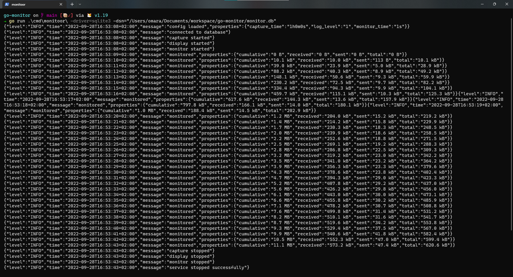

## Bandwidth Monitoring

A monitoring bandwidth tool implemented in Go

- Currently monitors 'all' the network interfaces on an operating system.
- Soon to support per-process monitoring.

Monitoor Core

- Monitoring with [gopsutil](https://github.com/shirou/gopsutil).
- Data Persistance with `sqlite3`
- Goroutines with: channels, errgroup (a better waitgroup)
- Graceful Shutdown with `os/signal`
- Native logging with `log`

  

